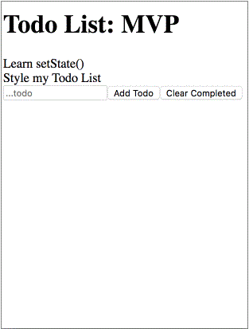

# React-Todo

We're going to practice building a stateful class component with this project. Even though hooks are gaining popularity among react developers, class components are going to be around for a long time. It's imperative that you get use to class components, and feel comfortable working with class components since you'll most likely need to work with them if you are hired to work on a React app.

## Introduction

- Your job is to write the components to complete the Todo List application.
- Your todo list should be fully functional and you should design it however you'd like. Feel free to get creative here. I have supplied a gif for you to see what the MVP functionality is.



- Your todo data should be an array of objects that look a lot like this:

```js
[
  {
    task: 'Organize Garage',
    id: 1528817077286,
    completed: false
  },
  {
    task: 'Bake Cookies',
    id: 1528817084358,
    completed: false
  }
];
```

- The `task` field is the todo title that will be shown to the user.
- The `completed` field should default to `false` and will be the field that we toggle when we complete a todo.
- The `id` field is a unique `Time Stamp` that will be assigned by `Date.now()`.

## Instructions

### Task 1: Set-up

- Fork and clone this project and cd into your cloned version.
- Create a new branch to work on
- `npm install` will pull in all the node_modules you need.
- `npm start` will start a development server on your `http://localhost:3000`.
  - If npm asks you to select different port with some error message, just confirm and it will pull it up on port 3001. This simply means you have a development server up and running on that port already.
  
- To turn in your project:
  - Go to the repo in GitHub
  - Make sure you are looking at base of the repo, and that the branch is set to your development branch
  - Copy the url
  - Paste the url into Canvas

### Task 2a: MVP

- **Don't focus on styling yet**. We want you to worry about function over form today.
- Your todo list should display a list of todos, an input field, a submit button, and a clear all button.
- Be sure to use the given files for building out these components.
- `<App />` will hold all the data needed for this project. It will also be the container for your Todo Components.
  - All of your application data will be stored here on `<App />`.
  - All of your `handler` functions should live here on `<App />`.
- `<TodoList />` receives your Todos array and iterates over the list generating a new `<Todo />` for each element in the array.
- `<Todo />` is a component that takes in the `todo` data and displays the task to the screen.
- `<TodoForm>` will hold your input field and your `Add Todo` and `Clear Completed` buttons.
  - Your input field should take in user input, and allow a user to press `Enter` or click on the `Submit Button` to add a todo to your list.
  - Once a todo is submitted, the Todo List should re-render and show the added todo.

---

- Add the functionality to toggle your todo's completed flag from `false` to `true`.
  - Once a todo is completed, be sure to demonstrate to the user that the todo is completed by adding a line-through style property if the completed flag is true.
- Add the ability to remove any todos that you have completed. `.filter` will be your best friend here. When a user clicks on the `Clear Completed` button call your handler function that will filter out any todos that have the completed flag toggled to `true`.
- **Now is the time to style** Take your time to make this an app that you can be proud of.

### Task 2b: Exit Ticket

Once you begin, you will have 15 minutes to answer the questions [here](https://app.codesignal.com/public-test/9ZYQYwqg6yDhnwpbf/vHhqLbvqiw8DvN).

The completion of these questions is mandatory for MVP. However, passing the quiz doesn't affect your standing as a Lambda School student whatsoever. This is Lambda School testing itself! Please answer honestly and to the best of your ability without using external references.

### Task 3: Stretch Problems

- **Persist your data** in `window.localStorage()` hint: you may have to pass your data to a stringifier to get it to live inside the `localStorage()` of the browser. This will cause it to persist past the page refresh.

- **Search Functionality** Add a input bar that allows you to search through your tasks and only show the ones that match the search input.

- **Hosting** Create a [Netlify Account](https://www.netlify.com/) and follow the tutorial on how to host your shiny new todo app on the world wide web.

## Submission Format
* [ ] Submit a Pull-Request to merge `<firstName-lastName>` Branch into `main` (student's  Repo). **Please don't merge your own pull request**
* [ ] Fill out your module retrospective form [here](https://forms.lambdaschool.com/module-retrospective) with a link to your PR
